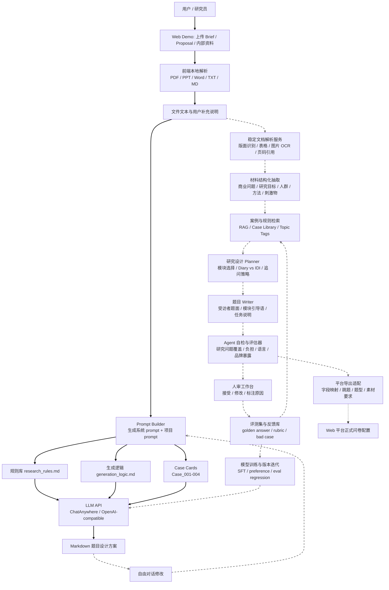

# DG Agent v0.1

Digital Diary 题目设计 Agent 的 demo / skill / 工程化雏形包。


## 1. 这个包解决什么

当前不是要“训练一个完整模型”，而是把题目设计 Agent 拆成三层：

- **Demo 层**：能上传材料、解析文本、拼接 prompt、调用大模型生成 Markdown 题目方案。
- **Skill 层**：把研究员逻辑、题目生成流程、case card、质量检查规则沉淀成可版本化、可评测、可训练迭代的规范层。
- **完整 Agent 系统层**：未来接入原有算法、后端和数据库，用大量历史最终版 DG 标答做自动生成、对比、评估和迭代。

demo 阶段的目标是证明“从 Brief / Proposal / 内部资料到 Digital Diary 题目设计”的主链路可跑通，同时把完整 Agent 的流程、数据契约、skill 版本和评测接口先设计好。demo 前台不一定展示所有功能，但系统骨架要按照完整 Agent 来搭。

正式工程化后，质量提升的核心不再是继续手工堆 prompt，而是利用数据库中的历史项目输入和最终版 DG 标答，形成自动评测和训练闭环。研究员的人工修改标注可以在 demo 阶段帮助建立第一版规则；后续应让模型自主批量生成，与标答对比，自动挖掘 gap，再进入规则、检索、训练和评测迭代。

## 2. 完整系统流程图

图中：

- **实线**：demo 阶段实现或已经有雏形。
- **虚线**：完整 Agent 系统应具备，但 demo 阶段只留接口或方法。



## 3. Demo 实现范围

demo 的用户可见层先实现“最短可用链路”：

1. 用户上传项目材料。
2. 前端或脚本解析出文本。
3. 使用 `src/prompt.py` 拼出模型输入。
4. 注入 `references/research_rules.md`、`references/generation_logic.md` 和相关 case card。
5. 调用 ChatAnywhere / OpenAI-compatible API。
6. 输出 Markdown 题目设计方案。
7. 用户通过自由对话继续修改。

但 demo 阶段的 skill / 工程设计已经包含完整 Agent 流程。以下能力在 demo 前台暂不完整呈现，但需要保留接口、文档或离线方法：

- 自动 OCR 和复杂版面解析。
- 真正的案例向量检索。
- 多 agent 协作 / planner-writer-evaluator 拆分。
- 自动题目字段导出。
- 完整评测平台。
- 数据库标答批量评测。
- 训练 / 回归门禁。

## 4. 完整 Agent 系统应如何扩展

完整系统建议拆成 8 个模块：

1. **Document Ingestion**
   - 输入：PDF、PPT、Word、TXT、MD。
   - 输出：带文件名、页码、段落、表格、图片说明的结构化文本。

2. **Project Understanding**
   - 抽取商业目标、研究目标、目标人群、方法、刺激物、已知假设。
   - 标记材料冲突和缺失信息。

3. **Case & Rule Retrieval**
   - 从 case card、历史项目、研究员规则中检索相似逻辑。
   - 只学习设计逻辑，不复制题目。

4. **Research Planner**
   - 决定模块结构、模块顺序、Diary vs IDI 分工、任务模块是否需要。
   - 生成少量必要确认问题。

5. **Question Writer**
   - 生成受访者可读的 Digital Diary 题面。
   - 固定模板题可锁定，例如“关于我”前三题。

6. **Agent Evaluator**
   - 检查研究问题覆盖、商业问题映射、题目语言、受访者负担、品牌暴露、重复与无效题。

7. **Human Review Loop**
   - 研究员修改题目，并标注为什么改。
   - 形成可进入 prompt / skill / eval set 的反馈。

8. **Platform Export Adapter**
   - 将 Markdown 转为平台题目字段。
   - 字段是否固定由平台决定，Agent 只给建议和映射。

9. **Data Training & Regression Loop**
   - 从数据库中抽取历史输入材料和最终版 DG 标答。
   - 当前模型批量生成。
   - 自动对比模型输出与标答。
   - 产出 gap report、规则候选、训练样本和回归测试结果。
   - 记录 model / skill / prompt / case library 版本，支持上线门禁。

## 5. Skill 化设计

demo 阶段已经预留 skill 草案，并已按多 agent 分工拆出题目设计与题面 wording 两层：

```text
skill/dg-questionnaire-designer/
├── SKILL.md
├── VERSION.json
├── references/
│   ├── agent_workflow.md
│   ├── data_contracts.md
│   ├── eval_rubric.md
│   ├── generation_logic.md
│   ├── research_rules.md
│   ├── case_001_gum.md
│   ├── case_002_chocolate.md
│   ├── case_003_wonton.md
│   └── case_004_45plus_health.md
└── scripts/
    └── prompt.py

skill/dg-question-wording-editor/
├── SKILL.md
├── VERSION.json
├── references/
│   ├── style_rules.md
│   ├── rewrite_patterns.md
│   ├── module_tone_guides.md
│   └── wording_eval_rubric.md
└── agents/
    └── openai.yaml
```

`dg-questionnaire-designer` 的定位：

- 当用户要求“根据 Brief / Proposal / 客户资料设计 Digital Diary 题目”时触发。
- 先读取 `agent_workflow.md`、`generation_logic.md` 和 `research_rules.md`。
- 根据项目类型选择相关 case card。
- 输出 Markdown 题目设计方案。
- 输出 `Wording Handoff`，为后续 wording agent 标记不能删除的研究意图、观察点、品牌暴露约束和负担风险。
- 对用户修改意见进行局部迭代，不每次从零生成。
- 在正式系统中作为“研究逻辑规范层”和“评测 rubric 来源”，与数据库标答、训练样本和模型版本一起迭代。
- 当涉及后端、数据库、训练或评测时，读取 `data_contracts.md`、`eval_rubric.md` 和 `VERSION.json`。

`dg-question-wording-editor` 的定位：

- 当用户要求“更自然 / 更口语 / 不像 checklist / 减少括号 / 降低受访者负担”时触发。
- 保留 designer agent 产出的研究意图、模块结构、观察点、Diary vs IDI 分工和品牌暴露顺序。
- 专门改写受访者可见的引导语、题目、结束语和素材请求。
- 维护固定 About Me 开场题、模块语气、坏例到好例改写模式和 wording 评估 rubric。

后续迭代方法：

- 新增 case 时，不直接塞完整原文，先写成 `case_cards/case_xxx.md`。
- demo 阶段研究员修改意见先沉淀到 `tests/model_tests/`，再抽象成规则。
- 正式阶段优先使用数据库中的最终版 DG 标答，让模型批量生成并自动对比，不再依赖研究员逐条标注。
- 稳定规则进入 `research_rules.md`。
- 流程级规则进入 `generation_logic.md`。
- 可复用题面模板进入 `dg-question-wording-editor` 的 references 或后续 `templates/`。
- 训练与自动迭代方法见 [docs/data_training_iteration.md](docs/data_training_iteration.md)。

## 6. 工程化接口预留

建议后续 Web demo / 正式平台按以下接口拆分：

- `POST /api/parse-files`
  - 输入上传文件。
  - 输出结构化文本数组。

- `POST /api/build-prompt`
  - 输入项目结构化文本、用户补充说明、可选 case ids。
  - 输出 OpenAI-compatible messages。

- `POST /api/generate-design`
  - 输入 messages。
  - 输出 Markdown 题目设计方案。

- `POST /api/revise-design`
  - 输入当前方案、用户修改意见、历史对话。
  - 输出局部或完整更新方案。

- `POST /api/evaluate-design`
  - 输入方案、项目材料、rubric。
  - 输出覆盖度、风险、修改建议。

- `POST /api/export`
  - 输入 Markdown 方案。
  - 输出平台字段草案。

详细字段见 [docs/engineering_interfaces.md](docs/engineering_interfaces.md)。

## 7. 文件结构

```text
DG_Agent_v0.1/
├── README.md
├── src/
│   └── prompt.py
├── scripts/
│   ├── run_chatanywhere_smoke.py
│   ├── run_model_test.py
│   └── test_prompt_with_cases.py
├── references/
│   ├── generation_logic.md
│   ├── research_rules.md
│   ├── researcher_logic_case001.md
│   └── case_cards/
├── docs/
│   ├── demo_spec.md
│   ├── demo_full_agent_mapping.md
│   ├── data_training_iteration.md
│   ├── engineering_interfaces.md
│   ├── eval_plan.md
│   ├── skill_iteration_method.md
│   └── system_flow.md
├── tests/
│   ├── model_tests/
│   └── prompt_tests/
└── skill/
    └── dg-questionnaire-designer/
```

## 8. 本地运行

先在 PowerShell 设置环境变量：

```powershell
$env:CHATANYWHERE_API_KEY="你的 key"
$env:CHATANYWHERE_BASE_URL="https://api.chatanywhere.tech/v1"
$env:CHATANYWHERE_MODEL="gpt-5-mini"
$env:DG_AGENT_CASE_ROOT="D:\Synocodes\agent"
```

连接测试：

```powershell
python .\scripts\run_chatanywhere_smoke.py
```

生成 Case_001 测试：

```powershell
python .\scripts\run_model_test.py --case case_001
```

任意 case 测试：

```powershell
python .\scripts\test_prompt_with_cases.py --case case_005
python .\scripts\run_model_test.py --case case_005
```

新增 case 建议放在：

```text
case_data/
  Case_005/
    Brief.xxx
    Proposal.xxx
    客户内部资料.xxx
    desk_research.xxx
    Final Digital Diary DG.xxx
```

生成时会读取 Brief / Proposal / 客户内部资料 / desk research 等输入材料，并自动排除文件名中包含 `Final Digital Diary`、`Final DG`、`最终` 或 `标答` 的文件。

如果要给新 case 补充品类、品牌、人群等信息，可在 case 文件夹内添加 `case_info.json`：

```json
{
  "category": "品类",
  "brand": "品牌",
  "target_audience": "目标人群",
  "has_idi": "是否有 IDI / 入户 / 后续访谈",
  "extra_notes": "给模型的补充说明"
}
```

注意：当前脚本是从原项目迁移过来的 demo 脚本，若在新目录独立运行，需要根据实际 case 文件位置调整输入路径。

`DG_AGENT_CASE_ROOT` 指向包含 `Case_001`、`Case_002` 等原始材料文件夹的目录。当前包默认不搬运原始客户材料，只保留可复用规则、case card 和测试记录。

## 9. 当前最重要的判断

只靠 4 个 case card 和 prompt 规则，确实不能让模型“学会研究员”。demo 阶段应把目标定为：

- 证明端到端链路可行。
- 暴露生成质量问题。
- 收集研究员修改意见。
- 把修改意见结构化成 skill / rules / eval set。

真正提升质量的关键不是继续堆 prompt，而是建立：

- 更稳定的材料结构化解析。
- 更系统的 case library。
- 数据库最终版 DG 标答。
- 自动生成 vs 标答对比。
- gap 聚类与规则候选生成。
- 自动评估 rubric。
- 模型 / skill / prompt / case library 的版本化回归测试。

## 10. 闭环状态

当前仓库已经补充一个本地 demo 闭环：

```text
prompt 构建 -> 模型生成 -> 研究员 review -> gap 分类 -> 规则 / rubric / 训练样本候选 -> skill 迭代
```

说明见 [docs/closed_loop_status.md](docs/closed_loop_status.md)。

可用脚本：

```powershell
python .\scripts\build_demo_loop_report.py --case case_001
```

新 case 同样可以生成闭环报告：

```powershell
python .\scripts\build_demo_loop_report.py --case case_005
```

这只能完成 demo 级闭环。公司数据库、公司后端、算法服务、历史最终版 DG 标答、批量评测、模型训练和生产回归门禁，仍需要进入工程环境后继续接入。
