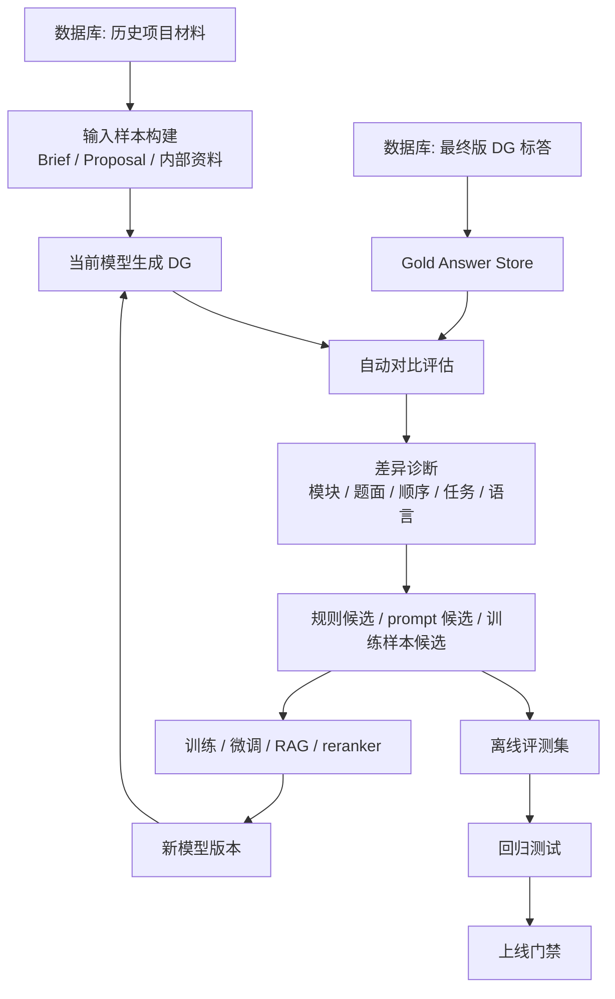

# Data-Driven Training & Iteration

正式工程化后，DG Agent 不应只依赖少量模板和 prompt。你们已有后端、算法和数据库，且数据库中会沉淀大量“标准答案”，也就是最终版 DG。这意味着系统应从 demo 的 prompt-driven，逐步升级为 data-driven + eval-driven。

## 1. 核心定位

skill 在正式系统中的作用不是替代训练数据，而是作为：

- 研究逻辑规范层。
- 生成流程约束层。
- 题面风格标准层。
- 自动评测 rubric 的来源。
- 数据训练前后的行为对照基线。

数据库中的最终版 DG 是高价值标答。skill 则定义“模型应该如何使用这些标答、如何对比、如何改进”。

## 2. 数据闭环



## 3. 数据对象

### TrainingCase

```ts
type TrainingCase = {
  caseId: string;
  projectType: string[];
  category?: string;
  brand?: string;
  targetAudience?: string;
  inputMaterials: {
    brief?: string;
    proposal?: string;
    internalMaterials?: string[];
    deskResearch?: string[];
  };
  goldDgMarkdown: string;
  goldMetadata?: {
    moduleNames: string[];
    diaryDays?: number;
    hasShoppingTask?: boolean;
    hasIdi?: boolean;
    respondentType?: string;
  };
};
```

### ModelRun

```ts
type ModelRun = {
  runId: string;
  caseId: string;
  modelVersion: string;
  skillVersion: string;
  promptVersion: string;
  generatedMarkdown: string;
  createdAt: string;
};
```

### AutoEvalResult

```ts
type AutoEvalResult = {
  runId: string;
  caseId: string;
  overallScore: number;
  dimensions: {
    projectUnderstanding: number;
    researchQuestionFit: number;
    moduleStructure: number;
    moduleOrder: number;
    questionWording: number;
    respondentBurden: number;
    brandExposureControl: number;
    diaryIdiSplit: number;
    taskDesign: number;
    goldSimilarity: number;
  };
  gaps: Array<{
    type:
      | "missing_module"
      | "extra_module"
      | "wrong_order"
      | "wrong_question_logic"
      | "too_rigid"
      | "too_generic"
      | "too_heavy"
      | "brand_exposed_too_early"
      | "bad_diary_idi_split"
      | "template_violation";
    evidence: string;
    goldReference?: string;
    suggestedRule?: string;
  }>;
};
```

## 4. 自动对比方式

不要只做文本相似度。最终版 DG 和模型输出可能文字不同，但研究逻辑一致。

建议分三层对比：

### 4.1 结构对比

- 模块数量是否接近。
- 模块名称是否语义对应。
- 模块顺序是否合理。
- 是否缺少任务模块、日记模块、习惯模块、品牌期待模块。
- 是否多了不必要模块。

### 4.2 研究逻辑对比

- 每个模块是否回答相同核心研究问题。
- 是否覆盖 Proposal 的关键问题。
- 是否把 Diary 和 IDI 分工处理正确。
- 是否保留客户明确要求。
- 是否重复客户已知信息。

### 4.3 题面语言对比

- 是否自然开放。
- 是否像 checklist。
- 是否括号示例过多。
- 是否命令感强。
- 是否过早暴露品牌。
- 是否过度打分、排序、强制上传。

## 5. 自动迭代策略

研究员标注到当前阶段可以停止增加。后续应让系统自动做：

1. 从数据库抽取历史 case。
2. 用当前 skill + prompt + model 生成 DG。
3. 与最终版 DG 标答对比。
4. 自动生成 gap report。
5. 将 gap 聚类。
6. 产出三类候选：
   - prompt / skill 规则修改候选。
   - 训练样本候选。
   - 检索 case card 候选。
7. 离线回归测试。
8. 达到上线阈值后更新版本。

## 6. Skill 在自动迭代里的接口

skill 应暴露稳定版本：

```text
skill_version
generation_logic_version
research_rules_version
case_card_version
fixed_template_version
eval_rubric_version
```

每次模型输出都应记录这些版本，方便知道质量变化来自：

- 模型变化。
- prompt 变化。
- skill 规则变化。
- case library 变化。
- 检索策略变化。

## 7. 推荐训练数据格式

适合构建 supervised / preference / eval 数据：

```json
{
  "case_id": "case_001",
  "input": {
    "brief": "...",
    "proposal": "...",
    "internal_materials": ["..."]
  },
  "gold_output": {
    "final_dg_markdown": "..."
  },
  "metadata": {
    "project_type": ["category_growth", "occasion_study"],
    "category": "gum",
    "method": "digital_diary",
    "has_shopping_task": true
  },
  "rubric": {
    "must_have_modules": ["关于我", "我典型的一天", "6天日记"],
    "fixed_questions": ["about_me_q1", "about_me_q2", "about_me_q3"],
    "avoid": ["too_many_parentheses", "early_brand_exposure"]
  }
}
```

## 8. 上线门禁

每次更新模型或 skill，至少检查：

- 总分不低于上一版本。
- 核心 case 不回退。
- 固定模板不被破坏。
- 确认问题不超过 3 个。
- About Me 前三题原样输出。
- 受访者题面不明显 checklist 化。
- 高风险项目类型有人工复核。

## 9. 阶段建议

### v0.1 Demo

- prompt + case card + manual review。

### v0.2 Data Eval

- 数据库接入历史输入和最终 DG。
- 批量生成。
- 自动结构对比和规则检查。

### v0.3 Auto Gap Mining

- gap 聚类。
- 自动提出规则候选。
- 构建 eval set。

### v0.4 Training Loop

- 训练样本构建。
- 模型版本管理。
- skill / prompt / model 联合回归测试。

### v1.0 Production

- 正式平台调用。
- 自动评测门禁。
- 人工抽检。
- 数据闭环持续迭代。
